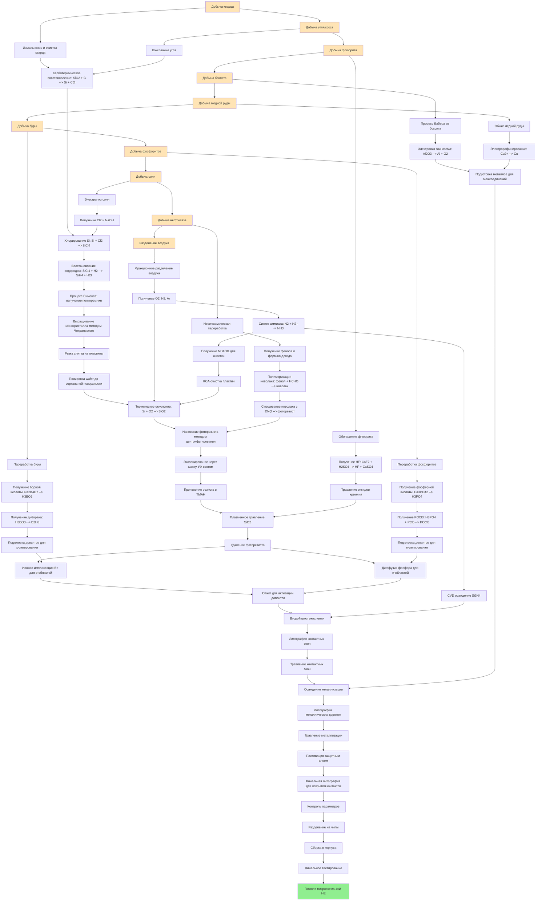

Клод нагенерировал куда интереснее и гораздо быстрее с его алгоритмом мышления 
https://claude.ai/chat/881f8afd-63c5-4a5f-95c0-163311dc6458
**Диаграмма процессов производства чипов** 

**Диаграмма компонентов использующихся в чипах и их процессов**

```mermaid
graph BT
    %% Природные ресурсы (самый нижний уровень)
    Quartz["🏔️ Кварц (SiO₂)<br/>Назначение: источник кремния"]
    Coal["⛏️ Уголь/кокс<br/>Назначение: восстановитель"]
    Fluorite["💎 Флюорит (CaF₂)<br/>Назначение: источник фтора"]
    Bauxite["🪨 Боксит (Al₂O₃·nH₂O)<br/>Назначение: источник алюминия"]
    CuOre["🥉 Медная руда<br/>Назначение: источник меди"]
    Borax["🧂 Бура (Na₂B₄O₇)<br/>Назначение: источник бора"]
    Phosphorite["⚡ Фосфорит<br/>Назначение: источник фосфора"]
    Salt["🧂 Поваренная соль (NaCl)<br/>Назначение: источник хлора"]
    Oil["🛢️ Нефть/природный газ<br/>Назначение: органические прекурсоры"]
    Air["💨 Воздух<br/>Назначение: источник O₂, N₂, Ar"]
    Water["💧 Вода (H₂O)<br/>Назначение: растворитель, источник H₂"]
    
    %% Базовые химические соединения (уровень 1)
    MetSi["🔘 Металлургический кремний<br/>Назначение: промежуточный продукт"]
    HF["⚗️ Плавиковая кислота (HF)<br/>Назначение: травитель оксидов"]
    Al["⚪ Алюминий металлический<br/>Назначение: металлизация"]
    Cu["🔶 Медь металлическая<br/>Назначение: межсоединения"]
    BoricAcid["🧪 Борная кислота (H₃BO₃)<br/>Назначение: прекурсор бора"]
    PhosphoricAcid["🧪 Фосфорная кислота (H₃PO₄)<br/>Назначение: прекурсор фосфора"]
    Chlorine["☢️ Хлор (Cl₂)<br/>Назначение: хлорирующий агент"]
    HCl["⚗️ Соляная кислота (HCl)<br/>Назначение: травление, очистка"]
    Phenol["🧪 Фенол (C₆H₅OH)<br/>Назначение: основа полимеров"]
    Formaldehyde["🧪 Формальдегид (HCHO)<br/>Назначение: сшивающий агент"]
    Oxygen["💨 Кислород (O₂)<br/>Назначение: окисление"]
    Nitrogen["💨 Азот (N₂)<br/>Назначение: инертная среда"]
    Argon["💨 Аргон (Ar)<br/>Назначение: защитная атмосфера"]
    Hydrogen["💨 Водород (H₂)<br/>Назначение: восстановитель"]
    
    %% Продвинутые прекурсоры (уровень 2)
    SiCl4["🧪 Тетрахлорид кремния (SiCl₄)<br/>Назначение: прекурсор поликремния"]
    SiH4["💨 Силан (SiH₄)<br/>Назначение: CVD прекурсор"]
    B2H6["💨 Диборан (B₂H₆)<br/>Назначение: p-допант"]
    POCl3["🧪 Оксихлорид фосфора (POCl₃)<br/>Назначение: n-допант"]
    NH3["💨 Аммиак (NH₃)<br/>Назначение: прекурсор нитридов"]
    NH4OH["⚗️ Гидроксид аммония<br/>Назначение: очистка пластин"]
    Novolac["🧪 Новолачная смола<br/>Назначение: основа фоторезиста"]
    DNQ["🧪 Диазонафтохинон (DNQ)<br/>Назначение: фотосенсибилизатор"]
    TMAH["⚗️ Гидроксид тетраметиламмония<br/>Назначение: проявитель"]
    IPA["🧪 Изопропиловый спирт<br/>Назначение: очистка"]
    Acetone["🧪 Ацетон<br/>Назначение: удаление резиста"]
    
    %% Высокочистые материалы (уровень 3)
    PolySi["⚪ Поликристаллический кремний<br/>Назначение: исходный материал"]
    PhotoResist["🎨 Позитивный фоторезист<br/>Назначение: литографическая маска"]
    SiO2["⚪ Диоксид кремния (SiO₂)<br/>Назначение: диэлектрик"]
    Si3N4["🔘 Нитрид кремния (Si₃N₄)<br/>Назначение: пассивация"]
    
    %% Полупродукты (уровень 4)
    SingleCrystal["💎 Монокристалл кремния<br/>Назначение: основа для пластин"]
    Wafer["🔘 Кремниевая пластина<br/>Назначение: подложка для схем"]
    
    %% Обработанные пластины (уровень 5)
    OxidizedWafer["🔘 Окисленная пластина<br/>Назначение: с диэлектрическим слоем"]
    PatternedWafer["🎨 Пластина с литографическим рисунком<br/>Назначение: для селективной обработки"]
    EtchedWafer["⚡ Протравленная пластина<br/>Назначение: с вытравленными областями"]
    
    %% Легированные области (уровень 6)
    PType["➕ P-легированные области<br/>Назначение: акцепторные зоны"]
    NType["➖ N-легированные области<br/>Назначение: донорные зоны"]
    
    %% Металлизированные структуры (уровень 7)
    MetalLayer["⚡ Слой металлизации<br/>Назначение: проводящие дорожки"]
    ContactWindows["🔗 Контактные окна<br/>Назначение: электрические соединения"]
    
    %% Готовое изделие (верхний уровень)
    FinalChip["🖥️ Готовая микросхема 4×И-НЕ<br/>Назначение: логический элемент"]
    
    %% Связи от природных ресурсов к базовым соединениям
    Quartz -->|"карботермическое восстановление<br/>1800°C, SiO₂ + C → Si + CO"| MetSi
    Coal --> MetSi
    Fluorite -->|"реакция с серной кислотой<br/>CaF₂ + H₂SO₄ → HF + CaSO₄"| HF
    Bauxite -->|"процесс Байера + электролиз<br/>Al₂O₃ → Al + O₂"| Al
    CuOre -->|"обжиг + электрорафинирование<br/>Cu²⁺ + 2e⁻ → Cu"| Cu
    Borax -->|"кислотная конверсия<br/>Na₂B₄O₇ + H₂SO₄ → H₃BO₃"| BoricAcid
    Phosphorite -->|"серно-кислотное разложение<br/>Ca₃(PO₄)₂ + H₂SO₄ → H₃PO₄"| PhosphoricAcid
    Salt -->|"электролиз рассола<br/>2NaCl + 2H₂O → Cl₂ + H₂ + 2NaOH"| Chlorine
    Salt --> HCl
    Oil -->|"каталитическая переработка<br/>фракционная перегонка"| Phenol
    Oil --> Formaldehyde
    Oil --> IPA
    Oil --> Acetone
    Air -->|"криогенное разделение<br/>фракционирование"| Oxygen
    Air --> Nitrogen
    Air --> Argon
    Water -->|"электролиз<br/>2H₂O → 2H₂ + O₂"| Hydrogen
    
    %% Связи к продвинутым прекурсорам
    MetSi -->|"хлорирование при 300°C<br/>Si + 2Cl₂ → SiCl₄"| SiCl4
    Chlorine --> SiCl4
    SiCl4 -->|"восстановление водородом<br/>SiCl₄ + 2H₂ → Si + 4HCl"| SiH4
    Hydrogen --> SiH4
    BoricAcid -->|"восстановление натрием<br/>термическое разложение"| B2H6
    PhosphoricAcid -->|"реакция с PCl₅<br/>H₃PO₄ + PCl₅ → POCl₃ + HCl"| POCl3
    Nitrogen -->|"синтез Габера-Боша<br/>N₂ + 3H₂ → 2NH₃"| NH3
    Hydrogen --> NH3
    NH3 -->|"растворение в воде<br/>NH₃ + H₂O → NH₄OH"| NH4OH
    Phenol -->|"поликонденсация<br/>катализ кислотой"| Novolac
    Formaldehyde --> Novolac
    Chlorine --> HCl
    
    %% Связи к высокочистым материалам
    SiH4 -->|"процесс Сименса<br/>1000°C, пиролиз"| PolySi
    Novolac -->|"смешение с сенсибилизатором<br/>DNQ-новолак система"| PhotoResist
    DNQ --> PhotoResist
    
    %% CVD процессы
    SiH4 -->|"термическое CVD<br/>900°C, SiH₄ → Si + 2H₂"| SiO2
    Oxygen --> SiO2
    NH3 -->|"LPCVD процесс<br/>700°C, плазма"| Si3N4
    SiH4 --> Si3N4
    
    %% Получение монокристалла и пластин
    PolySi -->|"метод Чохральского<br/>1414°C, вытягивание"| SingleCrystal
    SingleCrystal -->|"алмазная резка + полировка<br/>CMP процесс"| Wafer
    
    %% Обработка пластин
    Wafer -->|"термическое окисление<br/>1000°C, сухой O₂"| OxidizedWafer
    Oxygen --> OxidizedWafer
    OxidizedWafer -->|"центрифугирование<br/>нанесение фоторезиста"| PatternedWafer
    PhotoResist --> PatternedWafer
    PatternedWafer -->|"плазменное травление<br/>RIE процесс"| EtchedWafer
    HF --> EtchedWafer
    
    %% Легирование
    EtchedWafer -->|"ионная имплантация<br/>B⁺, 50 кэВ"| PType
    B2H6 --> PType
    EtchedWafer -->|"диффузия при 1000°C<br/>POCl₃ источник"| NType
    POCl3 --> NType
    
    %% Металлизация
    Al -->|"магнетронное распыление<br/>вакуумное осаждение"| MetalLayer
    Cu --> MetalLayer
    PType --> ContactWindows
    NType --> ContactWindows
    HF -->|"травление контактных окон<br/>селективное удаление SiO₂"| ContactWindows
    
    %% Финальная сборка
    PType -->|"формирование транзисторов<br/>CMOS технология"| FinalChip
    NType --> FinalChip
    MetalLayer --> FinalChip
    ContactWindows --> FinalChip
    Si3N4 -->|"пассивационный слой<br/>защита от влаги"| FinalChip
    
    %% Очистка и обслуживающие процессы
    NH4OH -->|"RCA-очистка<br/>удаление органики и металлов"| Wafer
    TMAH -->|"проявление резиста<br/>селективное растворение"| PatternedWafer
    IPA -->|"промывка и сушка<br/>удаление остатков"| Wafer
    Acetone -->|"стриппинг резиста<br/>полное удаление"| EtchedWafer
    
    %% Стилизация
    style FinalChip fill:#90EE90,stroke:#006400,stroke-width:3px
    style Quartz fill:#FFE4B5,stroke:#8B4513,stroke-width:2px
    style Coal fill:#FFE4B5,stroke:#8B4513,stroke-width:2px
    style Fluorite fill:#FFE4B5,stroke:#8B4513,stroke-width:2px
    style Bauxite fill:#FFE4B5,stroke:#8B4513,stroke-width:2px
    style CuOre fill:#FFE4B5,stroke:#8B4513,stroke-width:2px
    style Borax fill:#FFE4B5,stroke:#8B4513,stroke-width:2px
    style Phosphorite fill:#FFE4B5,stroke:#8B4513,stroke-width:2px
    style Salt fill:#FFE4B5,stroke:#8B4513,stroke-width:2px
    style Oil fill:#FFE4B5,stroke:#8B4513,stroke-width:2px
    style Air fill:#FFE4B5,stroke:#8B4513,stroke-width:2px
    style Water fill:#FFE4B5,stroke:#8B4513,stroke-width:2px
```

