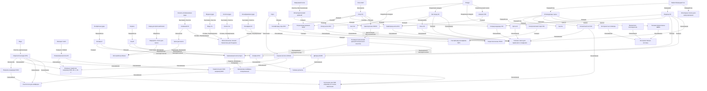

 AI studio размышления: 
Часть 1: Изучение процессов и создание первой диаграммы.

Я начну с детального изучения жизненного цикла создания примитивных микросхем, разбивая его на стадии и исследуя каждый процесс, используемые материалы и исходные компоненты.

Основные стадии производства микросхем:

    Добыча и очистка сырья:

        Добыча кварцевого песка (источник кремния).

        Очистка кварцевого песка до металлургического кремния.

        Превращение металлургического кремния в трихлорсилан (SiHCl3).

        Дистилляция трихлорсилана для получения поликристаллического кремния высокой чистоты (электронного качества).

        Добыча других металлов (медь, алюминий, золото, вольфрам и т.д.) и их очистка.

        Добыча и очистка газов (азот, кислород, аргон, водород и т.д.).

        Добыча и очистка воды (сверхчистая вода).

    Выращивание монокристаллов кремния (Були):

        Метод Чохральского: плавление поликристаллического кремния в тигле, добавление легирующих примесей (бор, фосфор), вытягивание монокристаллического слитка (були).

    Нарезка и полировка пластин (Вейферов):

        Нарезка були на тонкие пластины (вейферы) с помощью алмазных пил.

        Шлифовка и полировка вейферов до зеркального состояния.

        Очистка вейферов.

    Фотолитография:

        Очистка: Тщательная очистка вейфера.

        Нанесение адгезионного слоя: Для улучшения сцепления фоторезиста.

        Нанесение фоторезиста: Равномерное покрытие вейфера светочувствительным полимером.

        Экспонирование: Просвечивание фоторезиста через фотошаблон (маску) ультрафиолетовым светом.

        Проявление: Удаление экспонированных (или неэкспонированных, в зависимости от типа фоторезиста) участков фоторезиста, создание рисунка.

        Травление: Удаление незащищенных фоторезистом слоев материала (кремний, диэлектрик, металл) с помощью химических травителей (жидких или газообразных).

        Удаление фоторезиста: Очистка вейфера от остатков фоторезиста.

    Наращивание слоев (тонких пленок):

        Оксидирование: Выращивание слоя диоксида кремния (SiO2) на поверхности кремния (термическое оксидирование).

        Осаждение тонких пленок:

            Химическое осаждение из газовой фазы (CVD): Осаждение диэлектриков (SiO2, Si3N4) или проводников (поликремний, вольфрам) из газовых прекурсоров.

            Физическое осаждение из газовой фазы (PVD/Спуттеринг): Осаждение металлических слоев (алюминий, медь) путем бомбардировки мишени и осаждения атомов на вейфер.

    Легирование (Имплантация и Диффузия):

        Ионная имплантация: Введение атомов примесей (бор, фосфор, мышьяк) в кремний для изменения его электропроводности.

        Диффузия: Распределение примесей в кремнии при высокой температуре.

    Металлизация:

        Создание проводящих дорожек и контактов из металлов (алюминий, медь). Обычно включает осаждение металла, фотолитографию и травление.

    Планарная полировка (CMP - Chemical Mechanical Planarization):

        Выравнивание поверхности вейфера после осаждения слоев для обеспечения плоской поверхности для последующих литографических шагов. Используются абразивные суспензии.

    Тестирование на вейфере:

        Электрическое тестирование каждой микросхемы на вейфере для выявления дефектных чипов.

    Разделение вейфера на кристаллы (чипы):

        Нарезка вейфера на отдельные микросхемы (кристаллы) с помощью алмазной пилы.

    Корпусирование (упаковка):

        Монтаж кристалла в корпус (пластиковый, керамический).

        Присоединение выводов кристалла к выводам корпуса (бондинг).

        Герметизация корпуса.

    Финальное тестирование:

        Тестирование готовых микросхем в корпусе.


---

**Диаграмка процессов** 

```mermaid
graph TD
    subgraph "Добыча и первичная обработка сырья"
        A[Кварцевый песок] --> B{Очистка}
        B --> C[Металлургический кремний]
        C --> D{Хлорирование}
        D --> E[Трихлорсилан (SiHCl3)]
        E --> F{Дистилляция}
        F --> G[Поликристаллический кремний (электронного качества)]
        H[Природный газ/Нефть] --> I{Производство углеводородов}
        I --> J[Фоторезисты, растворители]
        K[Воздух] --> L{Разделение воздуха}
        L --> M[Азот, Кислород, Аргон]
        N[Вода] --> O{Сверхчистая вода (UPW)}
        P[Металлические руды (Бокситы, Медная руда и т.д.)] --> Q{Добыча и очистка металлов}
        Q --> R[Алюминий, Медь, Вольфрам, Золото и т.д.]
        S[Фосфатные руды, Бораты] --> T{Производство легирующих примесей}
        T --> U[Фосфин, Диборан]
        V[Флюорит, Серная кислота] --> W{Производство травителей}
        W --> X[Плавиковая кислота, Серная кислота]
    end

    subgraph "Производство кремниевых пластин (Вейферов)"
        G --> Y{Выращивание монокристаллов (Метод Чохральского)}
        Y --> Z[Кремниевый слиток (Буля)]
        Z --> AA{Нарезка}
        AA --> BB[Неполированные вейферы]
        BB --> CC{Шлифовка и полировка}
        CC --> DD[Полированные вейферы]
        DD --> EE{Очистка}
        EE --> FF[Готовые кремниевые вейферы]
        U --> Y
    end

    subgraph "Изготовление микросхем на вейфере (Front-End-of-Line - FEOL)"
        FF --> FG{Очистка вейфера}
        FG --> FH{Нанесение адгезионного слоя}
        FH --> FI{Нанесение фоторезиста}
        FI --> FJ{Экспонирование (УФ-свет через маску)}
        FJ --> FK{Проявление}
        FK --> FL{Травление (сухое/влажное)}
        FL --> FM{Удаление фоторезиста}
        FM --> FN{Очистка}
        J --> FI
        X --> FL
        M --> FL
        O --> FG
        O --> FN

        FG -- Повторяющиеся циклы --> FN

        FN --> FO{Термическое оксидирование}
        FO --> FP[Слой SiO2]
        FN --> FQ{Осаждение тонких пленок (CVD/PVD)}
        FQ --> FR[Слои диэлектриков, проводников, полупроводников]
        FR --> FS{Легирование (Ионная имплантация/Диффузия)}
        FS --> FT[Легированные области]
        U --> FS
        M --> FQ
        O --> FO

        FT -- Повторяющиеся циклы --> FQ
    end

    subgraph "Соединение слоев и металлизация (Back-End-of-Line - BEOL)"
        FT --> FU{Планарная полировка (CMP)}
        FU --> FV[Выровненная поверхность]
        FV --> FW{Металлизация (Осаждение, Фотолитография, Травление)}
        FW --> FX[Проводящие дорожки и контакты]
        FX -- Повторяющиеся циклы --> FU
        R --> FW
        J --> FW
        X --> FW
        M --> FW
        O --> FU
    end

    subgraph "Тестирование, разделение и корпусирование"
        FX --> FY{Тестирование на вейфере}
        FY --> FZ[Проверенные кристаллы на вейфере]
        FZ --> GA{Разделение вейфера (Нарезка)}
        GA --> GB[Отдельные кристаллы (чипы)]
        GB --> GC{Корпусирование (Бондинг, Заливка)}
        GC --> GD[Готовые микросхемы в корпусе]
        GD --> GE{Финальное тестирование}
        GE --> GF[Готовые к использованию микросхемы]
        R --> GC
        H --> GC
    end
```

=======

Список сущностей (материалов, реагентов, компонентов):

    Природные ресурсы (основа):

        Кварцевый песок (SiO2)

        Воздух (N2, O2, Ar)

        Вода (H2O)

        Нефть/Природный газ (углеводороды)

        Металлические руды (бокситы, медная руда, золотая руда, вольфрамовая руда и т.д.)

        Фосфатные руды

        Бораты

        Флюорит (CaF2)

        Сера (S)

        Соль (NaCl)

    Промежуточные материалы и химические соединения (первый уровень переработки):

        Металлургический кремний (Si)

        Хлор (Cl2)

        Трихлорсилан (SiHCl3)

        Поликристаллический кремний (электронного качества)

        Азот (N2)

        Кислород (O2)

        Аргон (Ar)

        Водород (H2)

        Сверхчистая вода (UPW)

        Алюминий (Al)

        Медь (Cu)

        Золото (Au)

        Вольфрам (W)

        Бор (B)

        Фосфор (P)

        Мышьяк (As)

        Плавиковая кислота (HF)

        Серная кислота (H2SO4)

        Аммиак (NH3)

        Изопропиловый спирт (IPA)

        Ацетон

        Тетрахлорид кремния (SiCl4)

        Диборан (B2H6)

        Фосфин (PH3)

        Арсин (AsH3)

        Оксид азота (N2O)

        Гексафторид серы (SF6)

        Хлорид водорода (HCl)

        Трифторид азота (NF3)

        Углекислый газ (CO2)

        Озон (O3)

        Перекись водорода (H2O2)

    Более сложные материалы и компоненты:

        Кремниевый слиток (Буля)

        Кремниевые вейферы (полированные)

        Фоторезисты (позитивные/негативные)

        Проявители (для фоторезистов)

        Растворители (для фоторезистов)

        Адгезионные промоутеры (например, HMDS - гексаметилдисилазан)

        Травители (например, смесь HF/HNO3/CH3COOH для кремния, Cl2/BCl3 для алюминия, SF6 для SiO2)

        Газы для CVD/PVD (SiH4, NH3, WF6, TEOS, TiCl4 и т.д.)

        Допанты (B2H6, PH3, AsH3)

        Суспензии для CMP (кремниевые, цериевые)

        Материалы для корпусирования (эпоксидные смолы, керамика, сплавы для выводов)

        Проволока для бондинга (золото, медь)

        Фотошаблоны (кварцевое стекло с хромовым покрытием)

**Диаграмка материалов и процессов**


