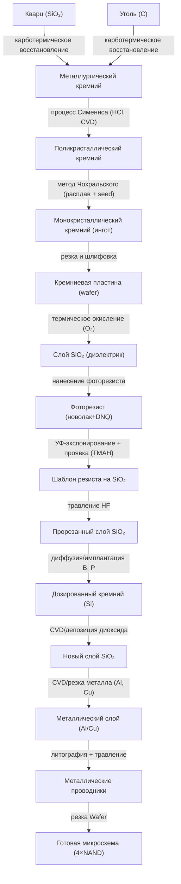
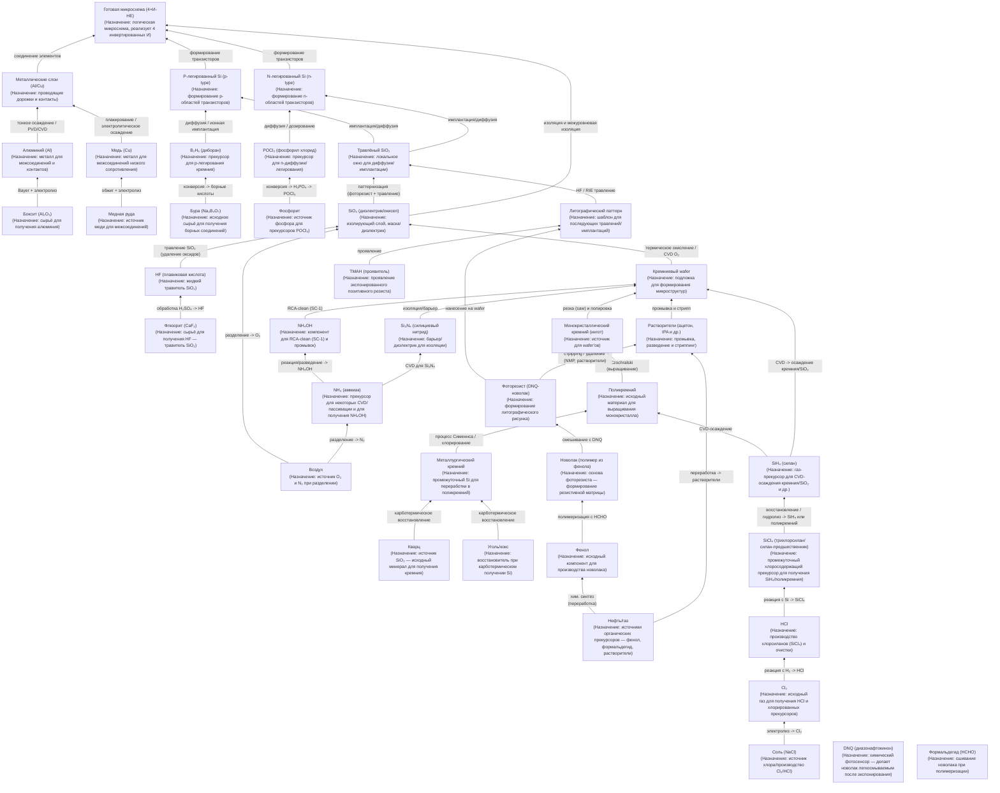
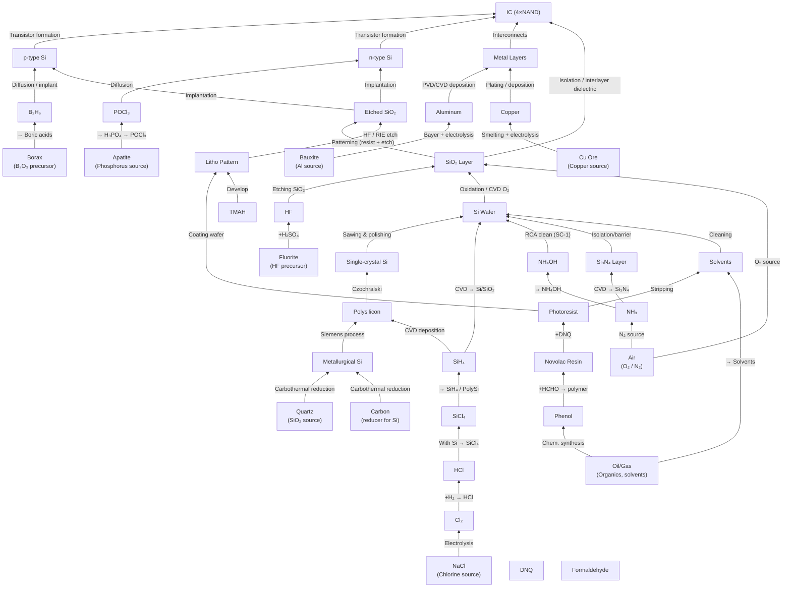

нагенерированные в gpt диаграммы  https://chatgpt.com/c/68c57c7e-98f0-832c-b600-984beebee001

первая - процессы 

Вторая - рессурсы с процессами

тут попытка ее сократить https://chatgpt.com/c/68c63041-b18c-8332-9e7f-64987302d3b7

